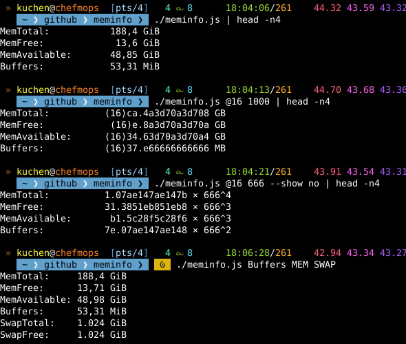

 

# `meminfo`
Will present you your `/proc/meminfo` in a more clean/better way.

There are also some (command line) options (plus some `const DEFAULT*` in the script);
they still need documentation here and in the `meminfo.syntax()` `--help` function!

> [!NOTE]
> Later I'll also try to implement it as pure `bash` shell script.
> But this is still **TODO**.

  

## Download
Implemented in plain Vanilla JavaScript, **without any dependencies**.

* [Version v**2.1.0**](./src/js/meminfo.mjs) (updated **2026-09-19**);

  

## Supported command line arguments
There are few supported argv[] parameters (beneath possible `const DEFAULT_*` switches in the code);
they still need a documentation (in the `meminfo.help()` function, and in here):

* `--prec[ision]`
* `--base`
* `--radix`
* `--locale`
* `--show`
* `--unit`
* `--index`

To keep the code minimal, I didn't implement a whole `getopt` module or stuff.
Just a merely 'hard-coded' `meminfo.getParameters()` function for only the
parameters used in here.

Additionally I introduced some syntactic elements to define some options w/ less characters.
These are **prefixes** to (mostyle numerical) values you need to append directly (without
any space or stuff):

* `@`: defines the `--radix`.
* `=`: defines the `--base`.

**Numeric** parameters will be treated like `=` or the `--base`.

**Upper Case** parameters are "presets". You can define more than one.
They set combinations of `/proc/meminfo` fields. See also the `const PRESETS[]`
(currently supported `MEM` and `SWAP`).

All other parameters define fields of `/proc/meminfo`. They can also be pure lower case;
if you define non-existing ones, it'll show an error for it.

Last but not least: defining a `+` argument will include ALL presets.

## Example Screenshots
Here are example screenshots of my tool.

 

### Current version v**2** (`meminfo`)
This is my newest version, which was intended to be a better
replacement for `cat /proc/meminfo` **only** (so it's renamed
from `mem` to `meminfo` now).

v**2**

 

### Original version v**1** (`mem`)

	
\[**click here** to expand\]
	This is my original, older implementation. It wasn't intended to be
	a replacement for `cat /proc/meminfo`, so the output looks not the
	same.. I previously used it (many times), but now I think the code
	is also a bit to bloated, maybe. And a bit dirty.. etc.
	

	v**1**
	

   

# Contact

 

# Copyright and License
The Copyright is [(c) Sebastian Kucharczyk](COPYRIGHT.txt),
and it's licensed under the [MIT](LICENSE.txt) (also known as 'X' or 'X11' license).

