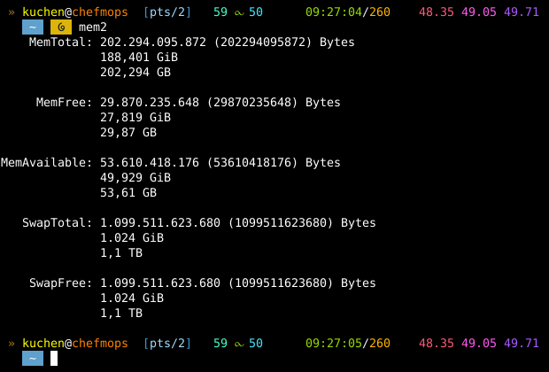

 

# `mem`
**TODO** (`.sh` and [`.js`](./src/js/mem.js))!

  

## Example Screenshot
v**0.4.0**

   

# Contact

 

# Copyright and License
The Copyright is [(c) Sebastian Kucharczyk](COPYRIGHT.txt),
and it's licensed under the [MIT](LICENSE.txt) (also known as 'X' or 'X11' license).

